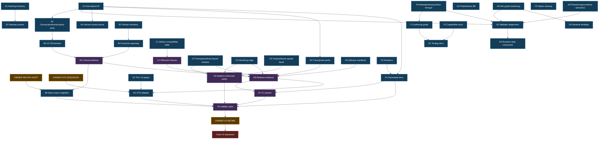

<!-- <FILE>docs/design/tui-vfx-v3-execution-dag.md</FILE> - <DESC>Dependency DAG for remaining tui-vfx V3 work, separating autonomous parallel tracks from owner-blocked decisions.</DESC> -->
<!-- <VERS>VERSION: 0.1.3</VERS> -->
<!-- <WCTX>Keep the execution DAG aligned with current completed-initial slices while preserving it as the remaining-work dependency map.</WCTX> -->
<!-- <CLOG>0.1.3: name Horseman as the current packaged thin-player surface.</CLOG> -->

# V3 execution DAG

This DAG translates the [V3 outstanding master punch list](tui-vfx-v3-outstanding-master-list.md)
into execution dependencies. Use it to dispatch parallel work safely: a task may
run when all of its prerequisites are done, even if unrelated tracks are still
open.

## Legend

- **Owner-blocked** — needs project-owner input before irreversible work.
- **Autonomous** — implementation/doc/tooling work can proceed from existing
  guidance.
- **Gate** — proof/evidence required before V3 stability claims.
- **Final-only** — must not start until every prerequisite is complete.

## Owner-blocked decisions

These are not on the critical path for most autonomous work, but they gate final
migration/product acceptance.

| ID | Decision | Blocks |
|---|---|---|
| `OWNER-RECIPE-AUDIT` | Which recipes are kept, migrated, rewritten, retired, or deferred | Final recipe migration scope; final V2 retirement |
| `OWNER-GTD-SEQUENCE` | When GTD adopts V3 surfaces such as `RecipeSceneCanvas` | GTD integration scheduling |
| `OWNER-RELATIVE-LIGHT` | Relative Light path: V3-only, lab-only V2, or feature-gated V2 | Whether Relative Light joins migration corpus |
| `OWNER-SCENE-CANVAS` | Confirm `RecipeSceneCanvas` remains neutral substrate | Public/downstream conceptual docs; GTD wrapper policy |
| `OWNER-LIVE-CAPTURE` | Live ANSI/command capture vs offline-only | Any live capture implementation; offline capture can continue |
| `OWNER-FIREWORKS` | Celebratory particles/fireworks priority/fidelity | Fireworks/particle product lane |
| `OWNER-PACKAGING` | Recipe/theme packaging and distribution model | Registry/archive/remote packaging work |
| `OWNER-DYNAMIC` | Dynamic recipe formalization | Beyond-current generated/runtime-dependent recipe model |
| `OWNER-V2-RETIRE` | Explicit final V2 retirement approval | V2 removal only |

## Parallel autonomous tracks

### Track A — Canonical IR, canonicalization, and validator core

Purpose: make V3 behavior inspectable, comparable, and enforceable.

Tasks:

- `A1-NIR`: normalized IR as explicit artifact.
- `A2-CANON`: canonicalization/property-test tooling.
- `A3-VALIDATE`: stricter schema/style diagnostics.
- `A4-HUMAN-QUEUE`: machine-readable human-review-needed report.
- `A5-PHASE-SCOPE-COMBINE`: accepted phase, scope, and combine semantics in
  validator/canonicalizer.
- `A6-HINTS`: hint graph hardening.

Dependencies:

- `A2-CANON` depends on `A1-NIR`.
- `A3-VALIDATE`, `A4-HUMAN-QUEUE`, `A5-PHASE-SCOPE-COMBINE`, and `A6-HINTS`
  can begin in parallel, but final completion should align on `A1-NIR`.

### Track B — Migration inventory and VC-09 equivalence

Purpose: prove migration quality while keeping V2 as the safety net.

Tasks:

- `B1-INVENTORY`: checked-in recipe inventory manifest.
- `B2-VC09`: migration-equivalence harness.
- `B3-OUTCOMES`: migration outcome reporting for `equivalent`, `replacement`,
  `retired`, and `owner_review_needed`.
- `B4-CRITICAL-EVIDENCE`: critical recipe equivalence/replacement evidence.
- `B5-CORPUS-MIGRATION`: kept recipe migration/rewrite.

Dependencies:

- `B1-INVENTORY` can proceed now with provisional classifications.
- `B2-VC09` can proceed now and should consume `A1-NIR`/`A2-CANON` when ready.
- `B3-OUTCOMES` depends on `B1-INVENTORY` and the accepted migration outcome
  policy; it does not need owner audit to start.
- `B4-CRITICAL-EVIDENCE` depends on `B2-VC09` and `B3-OUTCOMES`.
- `B5-CORPUS-MIGRATION` depends on `OWNER-RECIPE-AUDIT` for final scope, but
  provisional migrations/debug recipes may continue before that.

### Track C — Motion, shadow, edge, and spatial substrate

Purpose: close the remaining geometry/edge/showcase gaps.

Tasks:

- `C1-MOTION-MAP`: [V2 → V3 motion compatibility table](tui-vfx-v3-motion-compatibility-table.md) for `PathType`/offscreen/edge-crossing behavior.
- `C2-OFFSCREEN-FIXTURES`: V3 offscreen/slide fixtures.
- `C3-SHADOW`: transparent and host-bound shadow behavior.
- `C4-EDGE`: directional vanishing-edge behavior.
- `C5-SPATIAL`: surface/frame-space signal basis if still missing.
- `C6-MADEIRA`: richer Madeira/showcase parity.

Dependencies:

- `C1-MOTION-MAP` can proceed now.
- `C2-OFFSCREEN-FIXTURES` depends on `C1-MOTION-MAP`.
- `C3-SHADOW` and `C4-EDGE` can proceed in parallel but must integrate before
  release-gate evidence.
- `C5-SPATIAL` can proceed in parallel; it should stay in `mixed-signals` if it
  is reusable math/signal substrate.
- `C6-MADEIRA` depends on enough of `C3-SHADOW`, `C4-EDGE`, and `C5-SPATIAL` to
  demonstrate the intended richer visual system.

### Track D — Tooling, player, probe, trace, and CI gates

Purpose: provide the tools and evidence needed to trust V3.

Tasks:

- `D1-TOOLING-DOCS`: expand `docs/tooling/`.
- `D2-PLAYER`: keep the packaged `tui-vfx-horseman` thin V3 player/headless summary surface aligned with the playback seam.
- `D3-PROBE-DIFF`: keep probe database/frame-diff docs and surfaces aligned.
- `D4-TRACE-PARITY`: broader V3 trace/probe parity.
- `D5-RELEASE-MANIFESTS`: release-gate fixture manifests.
- `D6-RELEASE-EVIDENCE`: release-gate evidence capture/compare. See
  [`release-gate-evidence.md`](../tooling/release-gate-evidence.md).
- `D7-CI-CUTOVER`: Chapter 100 tooling/CI checklist.

Dependencies:

- `D1-TOOLING-DOCS`, `D2-PLAYER`, and `D3-PROBE-DIFF` can proceed now.
- `D4-TRACE-PARITY` depends on supported V3 execution surfaces and benefits from
  `A1-NIR`.
- `D5-RELEASE-MANIFESTS` can begin now using provisional fixtures.
- `D6-RELEASE-EVIDENCE` depends on `D5-RELEASE-MANIFESTS`, `B4-CRITICAL-EVIDENCE`,
  and relevant Track C fixtures.
- `D7-CI-CUTOVER` depends on `D4-TRACE-PARITY`, `D6-RELEASE-EVIDENCE`, and doc
  generation readiness.

### Track E — Naming, runtime surfaces, and downstream compatibility

Purpose: execute accepted names and keep downstream adoption safe.

Tasks:

- `E1-NAME-INVENTORY`: `Ra*` → `Vfx*`, `Preview*` → `Playback*`, and public seam
  rename inventory.
- `E2-NAME-CUTOVER`: execute rename buckets with re-exports/deprecation where
  needed.
- `E3-STYLE-CONSUMERS`: runtime-facing V3 style/family consumers.
- `E4-BINDINGS`: broader runtime binding evaluation.
- `E5-GTD-ADAPTER`: GTD integration/adaptation work.

Dependencies:

- `E1-NAME-INVENTORY` can proceed now.
- `E2-NAME-CUTOVER` depends on `E1-NAME-INVENTORY` and should be staged to avoid
  breaking active migration tooling.
- `E3-STYLE-CONSUMERS` and `E4-BINDINGS` can proceed in parallel with Track A,
  but should consume canonical validator semantics as they land.
- `E5-GTD-ADAPTER` depends on `OWNER-GTD-SEQUENCE` and enough of `D2-PLAYER` /
  `D6-RELEASE-EVIDENCE` to make downstream adoption safe.

### Track F — Authoring, generated docs, and capability documentation

Purpose: make V3 authorable by humans and AI agents.

Tasks:

- `F1-AUTHORING`: V3 authoring-guide rewrite.
- `F2-CAPABILITIES`: keep capabilities/reference docs current.
- `F3-RUSTDOCS`: rustdocs for public/schema-bearing V3 surfaces.
- `F4-DOCGEN`: generated schema/API/docs pipeline.
- `F5-STATUS-CLEANUP`: reconcile stale status docs.
- `F6-METADATA-TIMING`: implement accepted metadata/timing doc/schema/validator
  follow-through.

Dependencies:

- `F1-AUTHORING`, `F2-CAPABILITIES`, and `F5-STATUS-CLEANUP` can proceed now.
- `F3-RUSTDOCS` proceeds alongside each schema/public API implementation change.
- `F4-DOCGEN` depends on enough schema/API stability from Tracks A/E.
- `F6-METADATA-TIMING` can proceed now from the accepted Q21/Q23 decision.

## DAG overview

## Current status checkpoint

This DAG remains the dependency map, not the authoritative completion ledger.
Use the [master punch list](tui-vfx-v3-outstanding-master-list.md) for commit-level
evidence. As of the current checkpoint, do **not** redispatch first-slice work
for these completed-initial nodes unless the punch list names a follow-up slice:

| Node | Current dispatch guidance |
|---|---|
| `A5-PHASE-SCOPE-COMBINE` | First slice complete: `PhaseSet`, `scope_mode`, and explicit combine metadata are implemented. Dispatch only broader corpus/property or scheduler-classification follow-ups. |
| `A6-HINTS` | First slice complete: duplicate, missing, and kind-mismatched hint producers now hard-fail. Dispatch only broader corpus or integration follow-ups. |
| `D1-TOOLING-DOCS` | Complete-initial and ongoing: expand docs only when new tooling/evidence lands. |
| `F1-AUTHORING` | Complete-initial and ongoing: reconcile sibling schema/procedural/pipeline docs rather than rewriting the guide from scratch. |

## Recommended work waves

### Wave 1 — start immediately in parallel

Dispatch these tracks now; they have minimal cross-track dependency:

- `A1-NIR`, `A3-VALIDATE`, `A5-PHASE-SCOPE-COMBINE`, `A6-HINTS`
- `B1-INVENTORY`, `B2-VC09`, `B3-OUTCOMES`
- `C1-MOTION-MAP`, `C3-SHADOW`, `C4-EDGE`, `C5-SPATIAL`
- `D1-TOOLING-DOCS`, `D2-PLAYER`, `D3-PROBE-DIFF`, `D5-RELEASE-MANIFESTS`
- `E1-NAME-INVENTORY`, `E3-STYLE-CONSUMERS`, `E4-BINDINGS`
- `F1-AUTHORING`, `F2-CAPABILITIES`, `F5-STATUS-CLEANUP`, `F6-METADATA-TIMING`

### Wave 2 — start after first artifacts land

- `A2-CANON` after `A1-NIR` shape is concrete.
- `A4-HUMAN-QUEUE` after validator diagnostics have a stable reporting shape.
- `C2-OFFSCREEN-FIXTURES` after `C1-MOTION-MAP`.
- `D4-TRACE-PARITY` after V3 execution/probe surfaces are aligned with `A1-NIR`.
- `E2-NAME-CUTOVER` after `E1-NAME-INVENTORY` and when active tooling can absorb
  staged re-exports.
- `F4-DOCGEN` after `F3-RUSTDOCS` and enough schema/API stability.

### Wave 3 — integration/gate wave

- `B4-CRITICAL-EVIDENCE`
- `C6-MADEIRA`
- `D6-RELEASE-EVIDENCE`
- `D7-CI-CUTOVER`
- `E5-GTD-ADAPTER` after owner sequencing decision

### Wave 4 — final-only

- `B5-CORPUS-MIGRATION` final scope after owner recipe audit.
- `FINAL_STABLE` only after release gates and docs/tooling pass.
- `V2_RETIRE` only after explicit owner approval.

## Dispatch rules

- Keep V2 support intact on every track until `V2_RETIRE`.
- Prefer one agent per track or subtrack; avoid shared-file edits without a
  coordinator.
- Docs/tooling tracks can run ahead of implementation if they label unproven
  behavior as planned or required, not as shipped.
- Release-gate evidence beats visual intuition: prove with player/probe/trace /
  diff artifacts where available.
- Reusable math/signal substrate belongs in `mixed-signals`; recipe/render
  semantics belong in `tui-vfx` / `tui-vfx-recipes`; GTD display policy belongs
  downstream.

<!-- <FILE>docs/design/tui-vfx-v3-execution-dag.md</FILE> -->
<!-- <VERS>END OF VERSION: 0.1.2</VERS> -->
